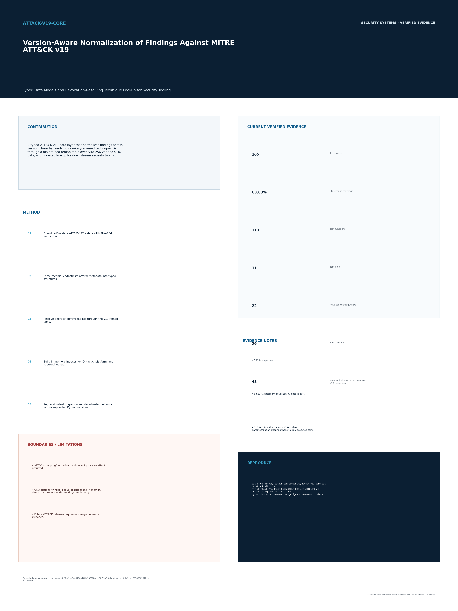

# attack-v19-core

<!-- security-systems-poster -->
## Research Poster

**Security Systems / 08 — Version-Aware Normalization of Findings Against MITRE ATT&CK v19**

[](poster/poster_36x48.pdf)

> Technical research poster (36 x 48 in). Click the image for the print-resolution **[PDF](poster/poster_36x48.pdf)**.
> Poster measurements are dated snapshots at their printed commits. Use the repository evidence files for newer results; do not read the poster as a verification of the latest `main`.
> Every metric on it is evidence-backed; historical/projected numbers are labeled and separated from current results.
> Part of the *Pooja Kiran - Security Systems* engineering poster collection.
<!-- security-systems-poster -->


**Maintainer:** Pooja Kiran ([@poojakira](https://github.com/poojakira))

## Overview

`attack-v19-core` provides typed Python (Pydantic) data models and O(1) in-memory lookup for MITRE ATT&CK v19, plus a revocation map that resolves deprecated technique IDs to their replacements across versions. It exists so detection rules and findings that reference ATT&CK IDs don't silently break when a release revokes, renames, or adds techniques. It downloads and SHA-256-verifies the official STIX bundle before building indexes.

## Verified Snapshot

Reproduced on current `main` (Python 3.12).

| Metric | Current verified result |
|---|---:|
| Tests | 165 passing locally on Python 3.12 (113 test functions across 11 files; 2026-09-30) |
| ATT&CK version | v19 (STIX bundle, SHA-256 verified) |
| Lookup | O(1) by ID / tactic / platform / keyword |
| ID remaps handled | 29 total (22 revoked in v19 + legacy) |

## Security Problem

ATT&CK evolves every release: v19 revoked 22 technique IDs, renamed a tactic, added TA0112 ("Defense Impairment"), and introduced 48 new techniques. Detection pipelines that hard-code IDs (e.g., `T1562` → now `T1685`) show green coverage dashboards while silently missing whole tactics. This library absorbs that version churn so downstream security tools stay correct across upgrades.

## Threat Model & Scope

**In scope:** deterministic, offline modeling and lookup of ATT&CK v19 objects; version-aware ID resolution; integrity-verified bundle loading.

**Out of scope / not claimed:** It is a data/lookup library, not a detector, SIEM, or telemetry source — it does not observe systems or generate findings on its own. Coverage is exactly the official ATT&CK v19 content it loads.

## Architecture

```text
Official ATT&CK v19 STIX bundle
      |  download + SHA-256 verify
      v
Pydantic models (Technique / Tactic / Mitigation / ...)
      |
      v
In-memory indexes (id, tactic, platform, keyword) + revocation map
      |
      v
O(1) lookup API  -->  consumed by sibling detection tools
```

## Core Capabilities

- Typed Pydantic models for every ATT&CK object type
- SHA-256-verified STIX bundle download and load
- Revocation map resolving deprecated IDs to replacements (v19 + legacy)
- O(1) indexes for lookup by ID, tactic, platform, or keyword
- Compatibility shim (`attack_core`) with a deprecation path to `attack_v19_core`


- Pydantic-validated models for Technique, Tactic, SubTechnique, Group, Software, Mitigation, DataSource
- Transparent revocation resolution (v18 ID in, v19 replacement out)
- In-memory indexes with O(1) lookup
- ATT&CK Navigator layer generation (v4.5 format)
- CLI for quick queries

**Note:** This repo contains two packages. `attack_v19_core` is the canonical package. `attack_core` is a deprecated compatibility shim kept for backward compatibility — importing it emits a `DeprecationWarning` and it will be removed in v20.0.0. Use `attack_v19_core` for new code:

```python
from attack_v19_core import ATTACKLoader, ATTACKIndex
from attack_v19_core.models import Domain
```

> Note on the CLI/download entry points: the `lookup`/`revoked`/`navigator`/`download` command-line interface and the STIX downloader currently live in the `attack_core` shim (`python -m attack_core ...`). Running them still works but emits the deprecation warning; the source-checkout wrapper `python scripts/download_attack_data.py` provides the same download without the `-m attack_core` form.

---

## Architecture Overview

```
+-------------------+       +-------------------+       +-------------------+
|  MITRE STIX Data  |       | attack_v19_core   |       |   attack_core     |
|  (GitHub / TAXII) |       |   (CANONICAL)     |       |   (DEPRECATED     |
|                   |       |                   |       |    SHIM + CLI)    |
+--------+----------+       +--------+----------+       +--------+----------+
         |                           |                           |
         | HTTPS download            |                           |
         v                           |                           |
+-------------------+                |                           |
| download.py       |<---------------+                           |
| - fetch bundles   |                                            |
| - SHA-256 verify  |                                            |
| - STIX validation |                                            |
+--------+----------+                                            |
         |                                                       |
         | JSON files on disk (~/.attack_data/)                  |
         v                                                       |
+-------------------+                                            |
| loader.py         |<-------------------------------------------+
| - parse STIX      |
| - build Pydantic  |
|   model instances |
+--------+----------+
         |
         | List[Technique], List[Tactic], ...
         v
+-------------------+     +-------------------+     +-------------------+
| index.py          |---->| matrix.py         |     | mapping.py        |
| - O(1) by ID     |     | - dict/JSON/CSV/  |     | - ATTACKMapping   |
| - by tactic      |     |   HTML export     |     |   builder         |
| - by platform    |     +-------------------+     | - Navigator layer |
| - keyword search |                               |   reporter        |
+-------------------+                               +-------------------+
         |
         v
+-------------------+
| cli.py            |
| - lookup command  |
| - revoked command |
| - navigator cmd   |
+-------------------+
```

**Component responsibilities:**

| Component | Role |
|-----------|------|
| `download.py` | Fetches pinned STIX bundles from GitHub, verifies SHA-256 hashes, validates STIX 2.x structure |
| `loader.py` | Parses STIX JSON into typed Pydantic models using `mitreattack-python` |
| `models.py` | Pydantic `BaseModel` definitions: Technique, Tactic, SubTechnique, Group, Software, Mitigation, DataSource, ATTACKMapping |
| `constants.py` | v19 canonical data: tactic lists, revocation maps, new technique IDs, platform lists |
| `index.py` | In-memory hash indexes for O(1) lookups by ID, tactic phase, and platform |
| `matrix.py` | Renders full ATT&CK matrices as dict, JSON, CSV, or HTML |
| `mapping.py` | Builds `ATTACKMapping` objects from technique IDs; generates Navigator layer JSON |
| `cli.py` | Command-line interface for lookup, revocation listing, and Navigator layer export |

---

## End-to-End Workflow

Here is how data moves from MITRE's published STIX bundles to a usable lookup in your code:

1. **Download:** `python -m attack_core.download` fetches three STIX bundles (Enterprise, Mobile, ICS) from MITRE's pinned v19.2 tag on GitHub. Each file is verified against a hardcoded SHA-256 hash and validated as a well-formed STIX 2.x bundle.

2. **Load:** `ATTACKLoader(stix_dir)` reads the three JSON bundles from disk, parses them through `mitreattack-python`, and instantiates Pydantic models for every ATT&CK object. Revoked and deprecated objects are filtered out (except DataSources, which are handled specially in v19).

3. **Index:** `ATTACKIndex(loader)` iterates all loaded models and builds three hash maps: by ATT&CK ID, by tactic phase name, and by platform. Lookups are O(1).

4. **Query:** Call `index.get("T1059")` for direct lookup, `index.by_tactic("TA0002")` for all Execution techniques, `index.by_platform("windows")` for platform filtering, or `index.search("scripting")` for keyword search.

5. **Map:** `ATTACKMappingBuilder(index).build("T1059.001", confidence=0.9)` produces a structured `ATTACKMapping` object ready to attach to detection findings.

6. **Export:** `ATTACKMatrix(index).to_json()` or `NavigatorLayerReporter().generate(name, mappings)` outputs Navigator-compatible JSON for visualization.

---

## Design Decisions and Trade-offs

**Pinned STIX bundles with SHA-256 verification.** The library downloads from a specific Git tag (`v19.2`) rather than pulling "latest" from the TAXII server. This makes builds reproducible and prevents silent data changes. The trade-off is that updating to a new ATT&CK version requires a code change to bump the tag and hashes.

**Two packages: `attack_v19_core` and `attack_core`.** The `attack_v19_core` package is the current, canonical package containing the data models, loader, index, matrix, and mapping. The `attack_core` package is a deprecated legacy shim retained for backward compatibility with existing dependents; importing it emits a `DeprecationWarning` and re-exports from `attack_v19_core`. The command-line interface and STIX downloader (`cli.py`, `download.py`, `__main__.py`) currently live in the `attack_core` shim, so `python -m attack_core ...` is the working CLI invocation today. New code should import from `attack_v19_core`. See the "What's In the Box" note and MIGRATION_GUIDE.md for details.

**Pydantic models over raw dicts.** Every ATT&CK object is a validated Pydantic `BaseModel`. This catches schema violations at load time rather than at query time, and gives downstream code IDE autocomplete and type safety. The trade-off is a dependency on Pydantic and slightly higher memory usage.

**Revocation map as a static dict.** `V19_REVOCATION_MAP` maps old technique IDs to new ones as a plain Python dictionary. This is fast to look up and easy to audit. The trade-off is that it must be manually maintained when MITRE revokes more techniques.

**Local file caching.** STIX bundles are cached in `~/attack_data/` after the first download. Subsequent loads read from disk with no network calls. The trade-off is that users must run the download command before first use.

**No async.** The library is synchronous. STIX parsing is CPU-bound, not I/O-bound once files are on disk. Adding async would add complexity without meaningful performance gain for the common use case.

---

## Tech Stack

| Layer | Technology | Version |
|-------|-----------|---------|
| Language | Python | >= 3.10 |
| Data models | Pydantic | 2.7.4 |
| STIX parsing | mitreattack-python | 3.0.3 |
| STIX types | stix2 | 3.0.1 |
| TAXII client | taxii2-client | 2.3.0 |
| Graph analysis | networkx | 3.3 |
| Tabular export | pandas | 2.2.2 |
| Build system | setuptools | >= 61.0 |
| Testing | pytest | >= 8.0 |
| Linting | ruff | (via pre-commit) |

## Installation

```bash
# Clone the repository
git clone https://github.com/poojakira/attack-v19-core.git
cd attack-v19-core

# Install dependencies
pip install -r requirements.txt

# Download STIX bundles (fetches ~80MB, caches locally)
python -m attack_core.download
```

For development:
```bash
pip install -e ".[dev]"
```

## Quick Start

```python
from attack_v19_core import ATTACKLoader, ATTACKIndex
from attack_v19_core.models import Domain

# Load all three matrices from local STIX data
loader = ATTACKLoader()

# Count techniques
techniques = loader.get_techniques(Domain.ENTERPRISE)
tactics = loader.get_tactics(Domain.ENTERPRISE)
print(f"{len(techniques)} techniques across {len(tactics)} tactics")
# 222 techniques across 15 tactics

# Build the index for fast lookups
index = ATTACKIndex(loader)
t = index.get("T1059")
print(t.name)  # "Command and Scripting Interpreter"
print(t.platforms)  # ['Windows', 'macOS', 'Linux', ...]
```

## Usage Examples

**Look up a technique by ID:**
```python
index = ATTACKIndex(ATTACKLoader())
technique = index.get("T1059.001")
print(technique.name)  # "PowerShell"
print(technique.parent_id)  # "T1059"
print(technique.tactic_ids)  # ["execution"]
```

**Resolve a revoked v18 ID to its v19 replacement:**
```python
from attack_v19_core.constants import V19_REVOCATION_MAP

old_id = "T1562"
new_id = V19_REVOCATION_MAP.get(old_id)
print(f"{old_id} -> {new_id}")  # T1562 -> T1685
```

**Find all techniques for a platform:**
```python
windows_techniques = index.by_platform("windows")
print(f"{len(windows_techniques)} techniques target Windows")
```

**Generate an ATT&CK Navigator layer:**
```python
from attack_v19_core import ATTACKMappingBuilder, NavigatorLayerReporter

builder = ATTACKMappingBuilder(index=index)
mappings = builder.build_many(["T1059", "T1059.001", "T1053"], confidence=0.8)

reporter = NavigatorLayerReporter()
layer_json = reporter.generate("my-detection-tool", mappings)
# Paste into ATT&CK Navigator to visualize coverage
```

**Export the full matrix as CSV:**
```python
from attack_v19_core.matrix import ATTACKMatrix

matrix = ATTACKMatrix(index)
csv_data = matrix.to_csv(Domain.ENTERPRISE)
with open("enterprise_matrix.csv", "w") as f:
    f.write(csv_data)
```

**CLI usage:**
```bash
# Look up a technique
python -m attack_core lookup T1059

# List all v19 revocations
python -m attack_core revoked

# Generate a Navigator layer
python -m attack_core navigator --output layer.json --domain enterprise
```

---

## Security Considerations

This is a local data library and CLI. It parses local STIX files and downloads external data; callers must treat configured data directories as trusted. The following measures are in place:

**Download integrity:**
- All STIX bundle URLs are restricted to an allowlist (`raw.githubusercontent.com` only)
- HTTP redirects are intercepted by `StrictRedirectHandler`, which rejects any redirect to a non-HTTPS or non-allowlisted host
- Every downloaded file is verified against a pinned SHA-256 hash before use
- A maximum download size (128 MB) prevents resource exhaustion from oversized payloads
- Downloaded files are validated as well-formed STIX 2.x bundles (correct JSON structure, `type: "bundle"`, non-empty objects array, STIX 2.x spec_version)
- Files failing validation are deleted immediately

**Dependency supply chain:**
- All dependencies are pinned to exact versions in `pyproject.toml` (e.g., `pydantic==2.7.4`, not `>=2.7`)
- A `uv.lock` lockfile provides reproducible installs

**Data handling:**
- No secrets or credentials are stored or transmitted
- Pydantic validation catches malformed data at parse time
- The library operates on read-only reference data; it does not modify system state

**Recommendations for consumers:**
- Run `python -m attack_core.download` in a controlled environment before deploying
- Verify the SHA-256 hashes in `download.py` match MITRE's published values if you are security-conscious about your supply chain
- Do not expose the raw STIX data directory to untrusted users

---

## Evaluation Methods and Results

**Test suite:** 113 test functions across 11 test files (165 tests after parametrization, passing locally on Python 3.12 on 2026-09-30) covering:
- Unit tests for each module (models, loader, matrix, mapping, index)
- Integration tests that validate parsed data against official STIX bundle structure
- CLI tests for all three commands
- v19 structural assertions (tactic count = 15, technique count = 222, sub-technique count = 475)

**Data coverage:**

| Matrix | Tactics | Techniques | Sub-techniques |
|--------|---------|-----------|----------------|
| Enterprise | 15 | 222 | 475 |
| Mobile | Yes | Yes | Yes |
| ICS | Yes | Yes | Yes |

**What the tests validate:**
- Tactic counts match MITRE's published numbers for v19
- Revocation map entries resolve to valid technique IDs in the loaded data
- Navigator layer output conforms to layer schema v4.5
- All Pydantic models serialize and deserialize without errors

**Limitations:**
- The library is pinned to ATT&CK v19.2. It will not automatically pick up future releases.
- DataSource objects in v19 STIX are marked as deprecated by MITRE; the loader works around this by loading them without the `remove_revoked_deprecated` filter.
- Group and Software `object_refs` parsing depends on STIX relationship objects being co-located in the bundle. Some complex multi-hop relationships may not resolve.
- Keyword search (`index.search()`) is a simple substring match, not fuzzy or semantic.

---

## Production Readiness Assessment

| Criterion | Status | Notes |
|-----------|--------|-------|
| Pinned dependencies | Yes | All exact versions in pyproject.toml + uv.lock |
| Reproducible data | Yes | SHA-256 verified STIX bundles from pinned Git tag |
| Type safety | Yes | Pydantic models with full type annotations |
| Test coverage | Good | 165 local passing tests, structural assertions against pinned data |
| Error handling | Good | Clear FileNotFoundError on missing data, hash mismatch raises RuntimeError |
| CI/CD | Yes | GitHub Actions (`.github/` directory present) |
| Documentation | Good | README, CHANGELOG, MIGRATION_GUIDE, RUNBOOK, THIRD_PARTY_NOTICES |
| Pre-commit hooks | Yes | Configured via `.pre-commit-config.yaml` |
| Security hardening | Good | Download allowlisting, redirect validation, SHA-256, STIX content validation |
| Python version | 3.10+ | Uses modern syntax (match, `|` unions) |

**Production release contract:**
- Tagged releases build wheel/sdist artifacts and publish the `attack-v19-core` package through PyPI trusted publishing.
- Release artifacts are accompanied by Sigstore signatures, a CycloneDX SBOM, and GitHub build provenance.
- Consumers that require maximum reproducibility should pin an exact package version and run the hash-verified ATT&CK data download during image/build creation.

**Further hardening opportunities:**
- Add a `--verify` CLI command that re-checks cached bundle hashes without redownloading.
- Complete migration of remaining CLI/downloader compatibility paths out of the deprecated `attack_core` shim.
- Add structured logging for long-running automation consumers.

---

## Roadmap and Future Improvements

- **v20 support:** When ATT&CK v20 ships, add an `attack_v20_core` package alongside v19, keeping both importable
- **Delta reporting:** Given two versions, show what was added, removed, renamed, or revoked
- **Relationship graph:** Use networkx to expose technique-to-group and technique-to-software graphs for threat modeling
- **Async download:** Optional async fetcher for parallelized bundle downloads in CI
- **TAXII live mode:** Optional direct TAXII server queries for organizations that want real-time data rather than pinned snapshots

---

## References

- [MITRE ATT&CK Framework](https://attack.mitre.org/)
- [ATT&CK v19 Release Notes](https://attack.mitre.org/resources/updates/)
- [ATT&CK STIX Data Repository](https://github.com/mitre-attack/attack-stix-data)
- [ATT&CK Navigator](https://mitre-attack.github.io/attack-navigator/)
- [STIX 2.1 Specification](https://docs.oasis-open.org/cti/stix/v2.1/stix-v2.1.html)
- [mitreattack-python Documentation](https://mitreattack-python.readthedocs.io/)

---


## Additional Documentation

- [INCIDENT_RUNBOOK.md](INCIDENT_RUNBOOK.md) - incident response for version breaks and hash mismatches
- [docs/PERFORMANCE_BASELINE.md](docs/PERFORMANCE_BASELINE.md) - O(1) lookup performance baselines
- [benchmarks/lookup_perf.py](benchmarks/lookup_perf.py) - performance regression gate

## License and Author

**License:** MIT

**Author:** [poojakira](https://github.com/poojakira)

**Repository:** [github.com/poojakira/attack-v19-core](https://github.com/poojakira/attack-v19-core)

---

## Engineering Lessons

The core insight from this project: version churn in shared threat intelligence schemas is an infrastructure problem, not an application problem. By isolating the ATT&CK version boundary into a dedicated library with typed models and a revocation map, every downstream consumer gets correctness for free. The alternative (each consumer parsing raw STIX and maintaining their own ID mappings) leads to inconsistency across teams and silent failures when IDs go stale. A thin, well-tested data layer with pinned versions and hash-verified downloads is worth more than a clever abstraction.

<!-- repo-verification:start -->
## Verification update — 2026-09-30

- **Scope:** Account-wide `poojakira` repository pass covering source/configuration, CI/release workflows, security-hygiene gates, dependency/SAST controls, and documentation consistency.
- **Remediation:** Pinned CI/release actions, including the cache action, to immutable revisions.
- **Verification state:** The previous hardened commit completed CI, Production Gate, Security Hygiene, and Documentation Integrity successfully; the final cache-pin commit was still re-running CI at the audit snapshot.
- **Security note:** The ATT&CK data/index controls remain versioned evidence; downstream consumers should pin the core revision they validate.
- **Evidence boundary:** This update records repository and GitHub Actions evidence observed during the pass. It is not a claim of independent penetration testing, production deployment, or zero residual risk.
<!-- repo-verification:end -->

## Verification checkpoint — 2026-09-30

- **Status:** VERIFIED GREEN FOR THE LISTED REPOSITORY GATES
- **Evidence:** CI, Security Hygiene, Documentation Integrity, and Production Gate completed successfully on the last verified main revision after the formatting, workflow-pinning, and history-scan fixes.
- **Boundary:** This is dated repository/Actions evidence, not a claim of zero vulnerabilities, external penetration testing, or universal production readiness.

## Secret handling

Keep runtime credentials outside Git. If this repository provides an `.env.example` or `.env.sample`, copy it to a local `.env` or `.env.local` and fill in values locally; the real environment file must remain untracked.

Do not commit AWS access keys or session credentials, API tokens, service-account JSON, private keys, package-manager credentials, Terraform state, or secret-bearing `tfvars`. CI/deployment credentials belong in GitHub Actions secrets or the deployment provider's secret manager. AWS account IDs are identifiers; AWS access-key IDs, secret access keys, and session tokens are credentials.

If a real credential is ever exposed, revoke or rotate it at the provider first, then remove it from the working tree and reachable Git history. The Security Hygiene workflow checks the current tree and reachable history for common credential formats without printing matched secret values.

## Security review — 2026-09-30

The current local review adds exclusively created temporary download files, rejects
credentialed and nonstandard-port URLs before requests and redirects, and handles
JSON nesting failures as validation errors. Download candidates remain hash-checked
and format-checked before replacing an existing trusted cache. Bandit now scans the
canonical package as well as the deprecated wrappers.

Use `ATTACK_DATA_DIR` to select a trusted cache directory, or pass `stix_dir` directly
to `ATTACKLoader`. Keep that directory inaccessible to untrusted local writers.
This library exposes no HTTP service, user accounts, or upload endpoint; request rate
limiting, authentication, and resource authorization belong to applications embedding
it. Integrity verification is enabled by default; disabling it transfers responsibility
for trusting local STIX content to the caller.

Verified locally: 165 pytest cases passed with the three hash-pinned v19.2 bundles;
Ruff lint/format and medium-confidence, medium-severity Bandit checks passed;
pip-audit reported no known vulnerabilities in the isolated installed environment
after updating its package installer. Gitleaks 8.24.3 found no matches in this clone's
reachable Git history. These checks do not cover provider secrets, inaccessible Git
objects, fork copies, or deployment configuration and do not establish zero risk.

<!-- security-local-config:start -->
## Secrets and local configuration

- Never commit real API keys, access tokens, passwords, cloud credentials, private keys, or a populated `.env` file.
- Local `.env` and `.env.*` files are ignored by Git. Only safe templates such as `.env.example` or `.env.sample` may be committed, and they must contain placeholder or empty values only.
- If an integration needs credentials, create your own local `.env` file (or use your shell/secret manager) and supply **your own** API key. In GitHub Actions, use repository/environment secrets rather than hard-coding values in workflow YAML.
- Do not copy or reuse any credential that appears in repository history, examples, tests, screenshots, logs, or documentation. Test strings are not intended to be usable credentials.
- If a real credential is ever committed, **revoke or rotate it at the credential provider first**, then remove it from the current tree and reachable Git history. Deleting a key from GitHub does not revoke it.
<!-- security-local-config:end -->

## Product validation

This repository separates **implementation evidence**, **public/external interoperability checks**, and **real deployment or customer evidence**. See [PRODUCT_VALIDATION.md](PRODUCT_VALIDATION.md) for the current validation ladder, reproducible checks, and the claims that are deliberately out of scope. A passing test or public-data canary is not presented as customer adoption or universal production efficacy.


### Maintained Python quality checks

Use Ruff 0.8.4 to match the repository's CI tool version. Run `ruff check .`
and `ruff format --check .` from the repository root. These checks include maintained
source, tests, scripts, examples, benchmarks, validation helpers, and poster generators
where present. Ruff's standard exclusions omit version-control metadata, virtual
environments, and build/cache directories; generated poster HTML/PDF/PNG assets are
not Python source. Passing these static checks does not establish runtime behavior or product effectiveness.
